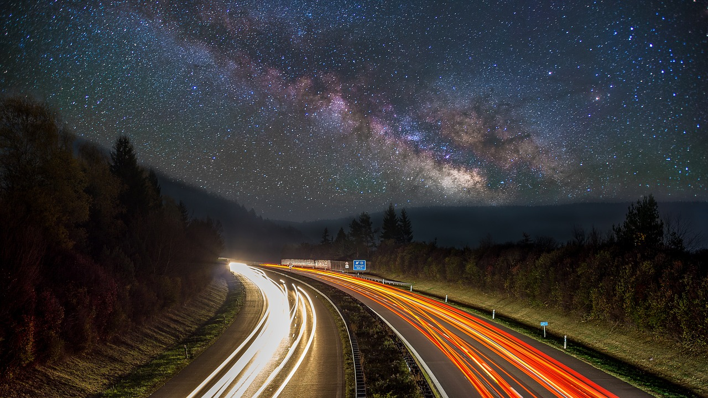
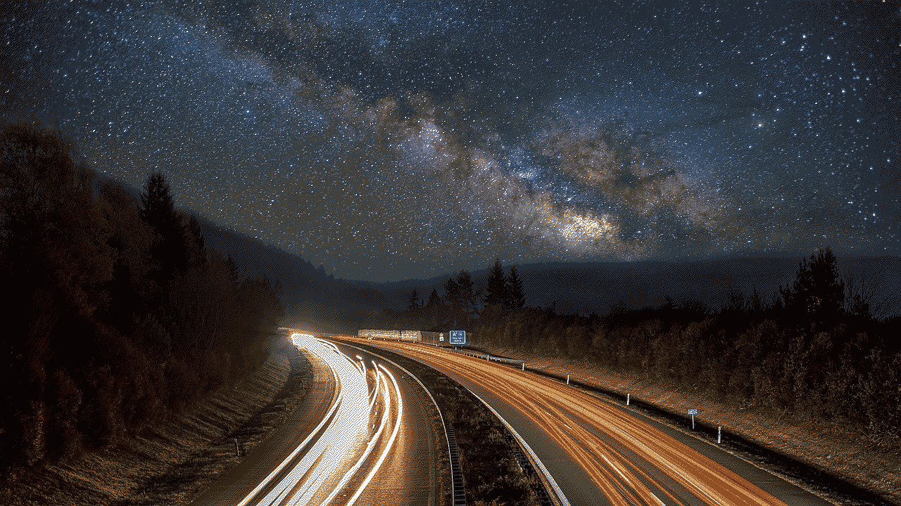
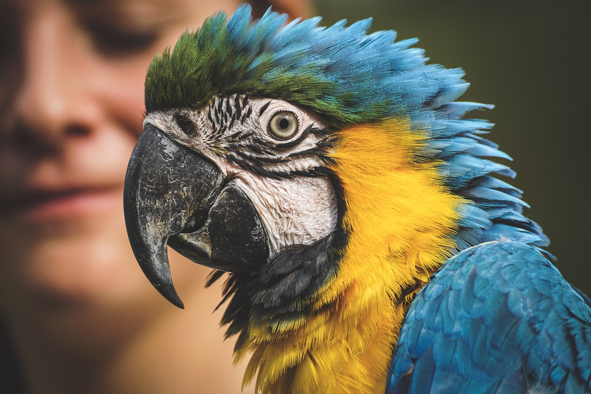
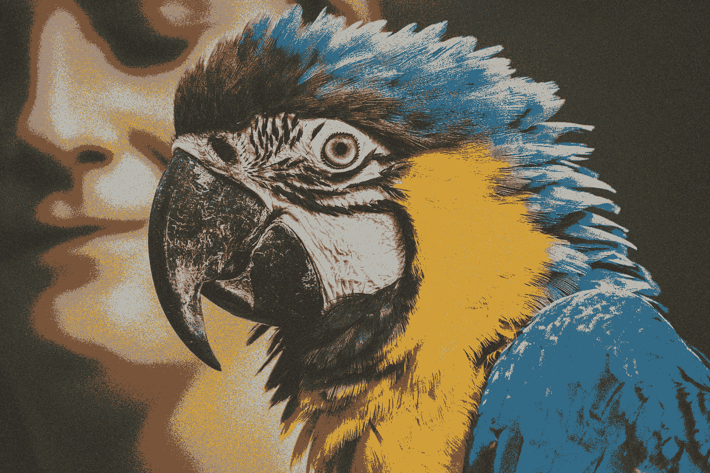
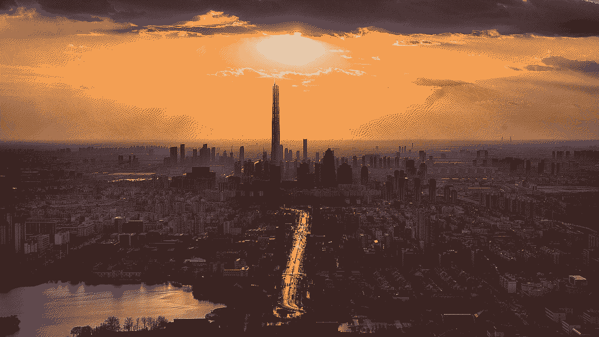
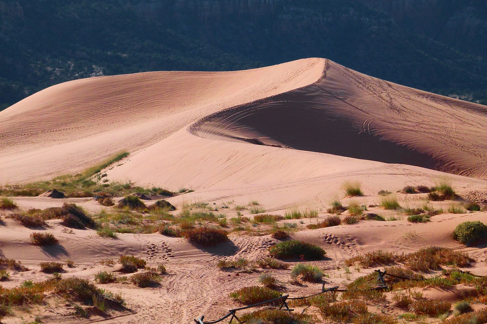
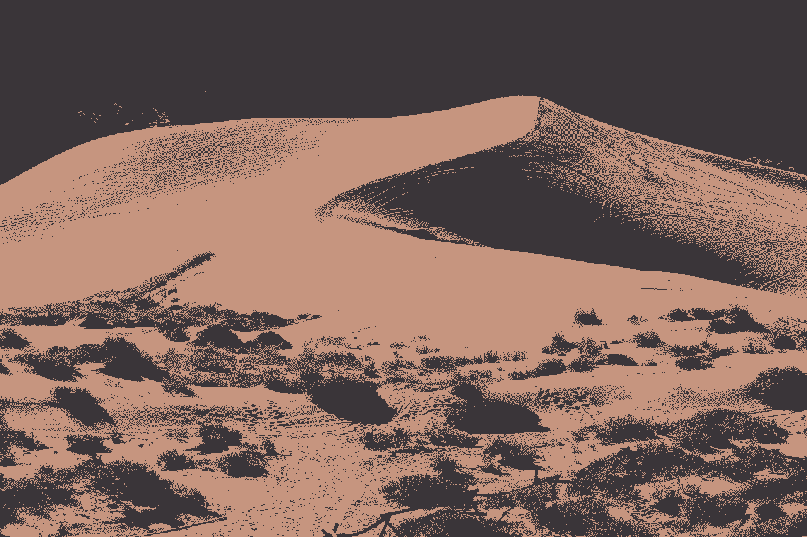

# ditherer

# Info

Dithering and palette selection algorithms implemented in python.

All the showcase images are cc0, downloaded from pixabay.com.

# Showcase

Original

Dithered - 3x3, 16 colors

Original

Dithered - Random, 8 colors

Original

Dithered - 2x2, 4 colors

Original

Dithered - 2x2, 2 colors

